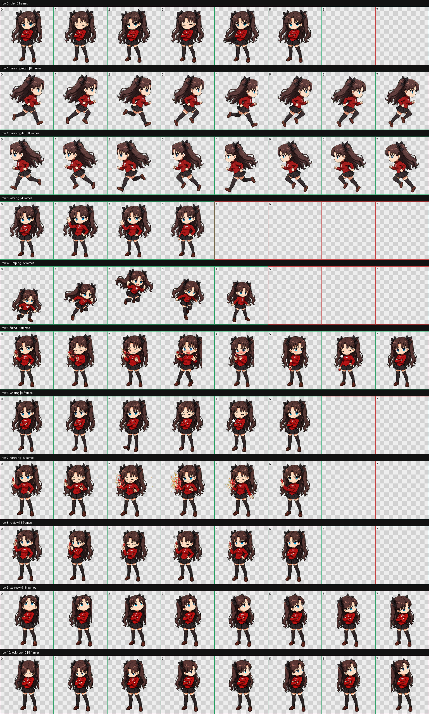
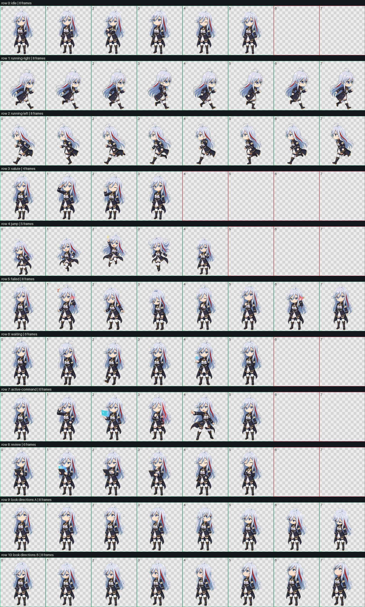
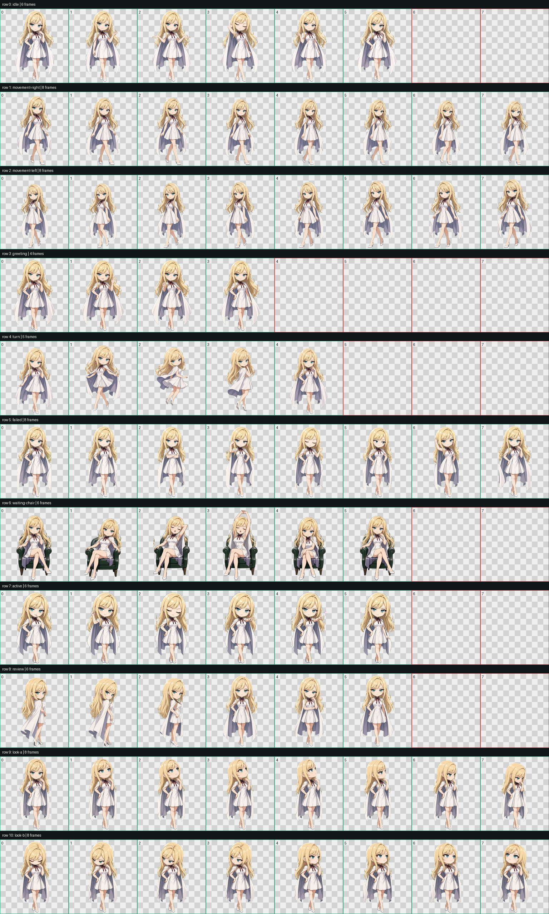

# Codex Familiar Pets

*A tiny atelier for custom Codex companions.*

一间为 Codex Desktop 制作桌面使魔的非官方小工坊。这里收录可以直接安装的自定义宠物包；项目名称不限定猫咪，也欢迎角色型、动物型和原创使魔。

当前每个宠物都采用 Codex v2 图集规格：1536×2288 WebP、8 列 × 11 行、单格 192×208 像素。

## 已收录的使魔

| 宠物 | 风格 | 预览 | 目录 |
| --- | --- | --- | --- |
| Mochi Kitten | 姜黄与奶油色原创小猫 | [查看动作表](previews/mochi-kitten.png) | [`pets/mochi-kitten`](pets/mochi-kitten) |
| Rin Tohsaka | 《Fate/stay night》远坂凛 Q 版同人 | [查看动作表](previews/rin-tohsaka.png) | [`pets/rin-tohsaka`](pets/rin-tohsaka) |
| Vladilena Milizé | 《86—不存在的战区—》蕾娜军装 Q 版同人 | [查看动作表](previews/vladilena-milize.png) | [`pets/vladilena-milize`](pets/vladilena-milize) |
| Gigi Andalucia (Chibi) | 《机动战士高达：闪光的哈萨维》琪琪 3.3 头身大脸动画风同人 | [查看动作表](previews/gigi-andalucia-chibi.png) | [`pets/gigi-andalucia-chibi`](pets/gigi-andalucia-chibi) |







## 安装

克隆仓库，然后将所选目录原样复制到 Codex 的宠物目录。例如安装凛：

```sh
mkdir -p "$HOME/.codex/pets/rin-tohsaka"
cp pets/rin-tohsaka/pet.json "$HOME/.codex/pets/rin-tohsaka/pet.json"
cp pets/rin-tohsaka/spritesheet.webp "$HOME/.codex/pets/rin-tohsaka/spritesheet.webp"
```

安装其他宠物时，把命令中的 `rin-tohsaka` 换成 `mochi-kitten`、`vladilena-milize` 或 `gigi-andalucia-chibi`。如果目标目录已经存在，请先自行备份。

随后在 Codex Desktop 中打开 **Settings → Pets**，刷新列表并选择新宠物；在任务中使用 `/pet` 可以唤醒或让它休息。

每个宠物包只包含：

```text
pet.json
spritesheet.webp
```

## 校验

发布文件的 SHA-256 记录在 [`checksums.txt`](checksums.txt)。所有图集都经过尺寸、网格结构和透明背景检查。

## 使用与权利说明

这是社区制作的非官方项目，与 OpenAI、TYPE-MOON、《Fate》系列、《86—不存在的战区—》系列、Sunrise 或《机动战士高达》系列无隶属或背书关系。

仓库公开并不意味着其中所有素材均采用开源许可。原创 Mochi 素材与角色同人素材仅供个人、非商业用途；远坂凛、蕾娜、琪琪及相关知识产权归各自权利人所有。详情见 [`NOTICE.md`](NOTICE.md)。
